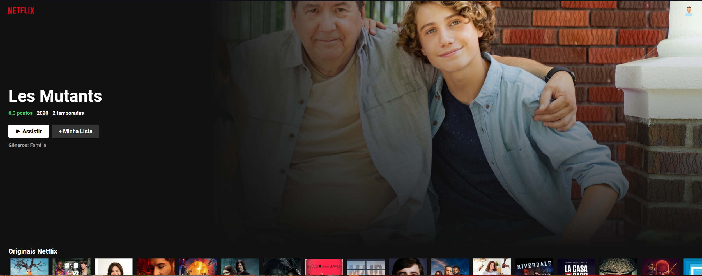

<div>
</img>
<h1 align="center" > Netflix Interface Clone </h1>
</div>

<p align="center"> Um projeto criado para estudar ReactJS </p>

<br/>
<div align="center">

</div>
<br />
<br />

## O projeto ✏

<p>Um projeto bem simples, da antiga interface do usuário (UI) da Netflix, feita para testar e aprender sobre React e construção de pages consumindo APIs como a do TMDB</p>

<br />

## Status do Projeto ☑

> Status do Projeto: Concluido ✅

<br />

## Deploy da Aplicação na Vercel 💿

> https://netflix-ui-clone-lilac.vercel.app

<br />

## Como rodar a aplicação ▶️

- Procure uma pasta de sua preferência e no terminal cole o seguinte comando:

  ```git clone https://github.com/hash-luk/Netflix-UI-Clone.git```

- Entre na pasta do projeto, com o seguinte comando:

  ```cd Netflix-UI-Clone```

- Instale a depedências com:

  ```npm init```

- Rode o projeto com:

  ```npm start```

- O projeto irá abrir automaticamente no navegador padrão,caso não ocorra vá até:

  ```localhost:3000```

<br/>

## Linguagens e Libs usadas 📚

- [ReactJS](https://pt-br.reactjs.org)
- [MaterialUI](https://mui.com/pt/)
- [TMDB API](https://www.themoviedb.org)
- [Node](https://nodejs.org/en/)


<br />

## Direitos e Licenças 📜

- Todos os direitos reservados a [Netflix](https://www.netflix.com/)
- Todos os dados retirados do [TMDB](https://www.themoviedb.org)
- A licença do projeto está em MIT no arquivo [LICENSE](LICENSE)

<br />

## Imagem do Projeto 📷


</img>


<br/>
<br/>


<p align="center">Desenvolvido com ❤ por  Lucas P</p>

